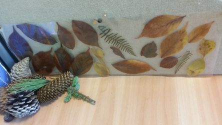

## Laminate Desk or Picture Decoration
1. Collect Autumn leaves of different shapes and colours then leave to dry
2. Place leaves in an A4 laminating pouch 
3. Close pouch then feed through a laminator as normal
4. The laminated leaves can last years without losing colour

## Cling Film Window Decoration

1. Collect Autumn leaves of different shapes and colours then leave to dry
2. Unroll some cling film on a table (don't cut it yet)
3. Arrange the leaves on the cling film taking note of the different colours and shapes of the leaves
4. Now unroll the same lenght of cling film back on itself to form a cling film sandwich with the leaves in the middle
5. Rub the cling film leaf sandwich against a window. It will cling to the window due to static electricity. This makes a lovely window decoration

