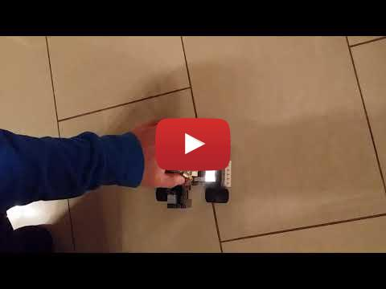
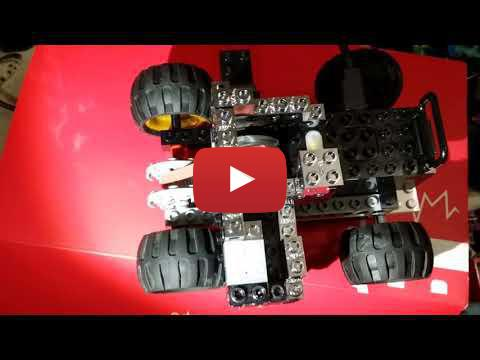
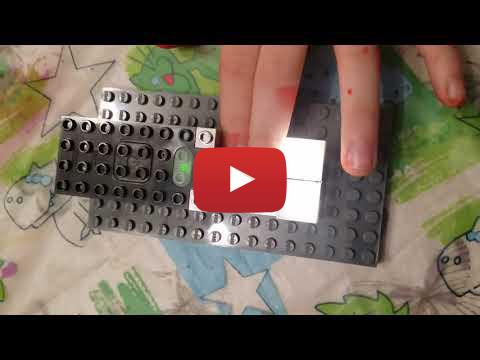

Sound starts and stops the motor. 
Lights come on in the dark, and turn off when bright.

## Part 1 Click your fingers to start or stop the Brixo Car motor
This uses the Brixo
- sound sensor
- battery
- motor

and various other lego pieces.

## Part 2 Car lights go on and off automatically depending on how bright it is
This uses the Brixo
- light sensor
- battery
- 2 x Brixo LED light blocks

and various other lego pieces.

### First we build a simple test circuit to prove it works

### Then we put it all together
Sound starts and stops the motor. 
Lights come on in the dark, and turn off when bright.

