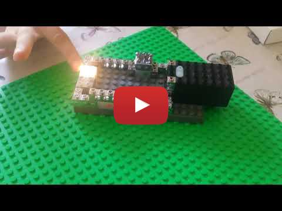

# Lego Circuits

## Demo 

## Lego Circuit With Sensors And Light
In this session, we built a circuit with a light and 3 sensors
- Proximity
- Sound
- Light

| Sensor      | Trigger        | 
|:------------- |:-------------| 
| Proximity     | When magnet is close, the switch closes            | 
| Sound         | Switch toggles open-to-close or close-to-open in response to a loud sound            | 
| Light         | When light is present, the switch opens            | 

