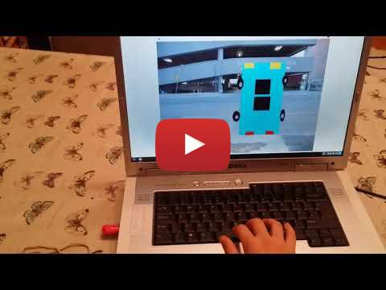

---
path: "/CarLightsScratch"
title: "Car Lights Scratch"
date: "2018-11-18"
cover: "./carlightsscratch.png"
tags: [ 'coding', 'leds', 'electronics', 'simulation']
published: true

# Part 1 Simulating Using Scratch

## Demo 

## Car Lights 
In this session, we'll use Scratch to simulate car lights and horn
- Horn sounds when button pressed
- Lights indicate movement: left, right, stopping.

This allows us to developer our idea easily before we try it on real hardware (electronics)

Lights indicate Movement

| Movement      | Key         |  Light                        
|:------------- |:------------| :-----                        
| Forward       | Up arrow    | purple                         
| Backward      | Down arrow  | pink                          
| Stop          | Spacebar    | Front and back flicker Green  
| Left          | Left arrow  | Left Front and Back Blue      
| Right         | Right arrow | Right Front and Back white    

   

## Materials Required

1. Computer running Scratch

TODO: add link to scratch program

