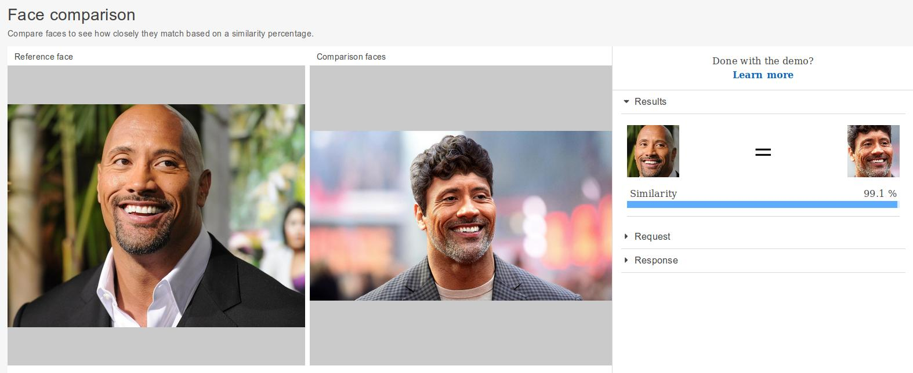
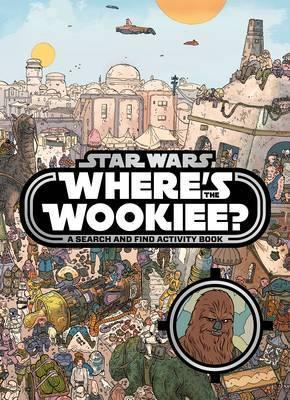
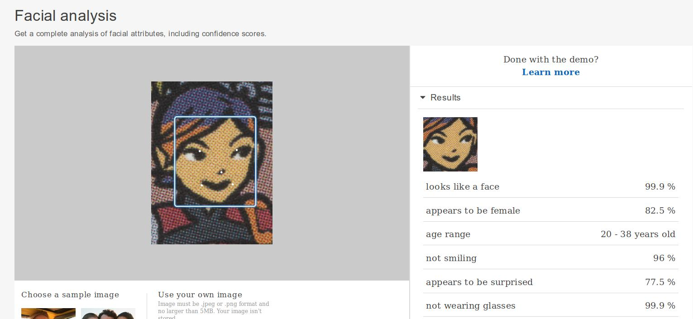

# Using Amazon AWS Rekognition to analyse some images of Dwayne Johnson

See https://aws.amazon.com/rekognition/ 

Using Amazon AWS Rekognition, we can upload images and do analysis:
* Object and scene detection
* Image moderation
* Facial analysis
* Celebrity recognition
* Face comparison
* Text in image

## Celebrity Recognition
### Recognise Dwayne Johnson
Recognised the picture as Dwayne Johnson and provided a link to IMDB. (100% confidence).

## Face Comparison

### Recognise Dwayne Johnson from a group
Recognised Dwayne Johnson from a group of 4 people. (99.7% confidence)

### Recognise Dwayne Johnson with hair 
Recognised Dwayne Johnson with no hair and Dwayne Johnson with hair. (99.1% confidence)

## Text Recognition
### Recognise handwritten message
Recognised the handwritten message from Dwayne Johnson

# Using Amazon AWS Rekognition to Play Where's Wookiee

In "Star Wars: Where's the Wookiee? Search and Find Book" you are given several characters that you have to find in a crowd of characters. 
This can take a few minutes for people - let's see how Amazon Rekognition does.

Amazon Rekognition recognises the cartoon image face.

Amazon Rekognition cannot find the face in the crowd.

