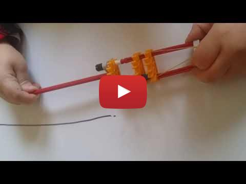
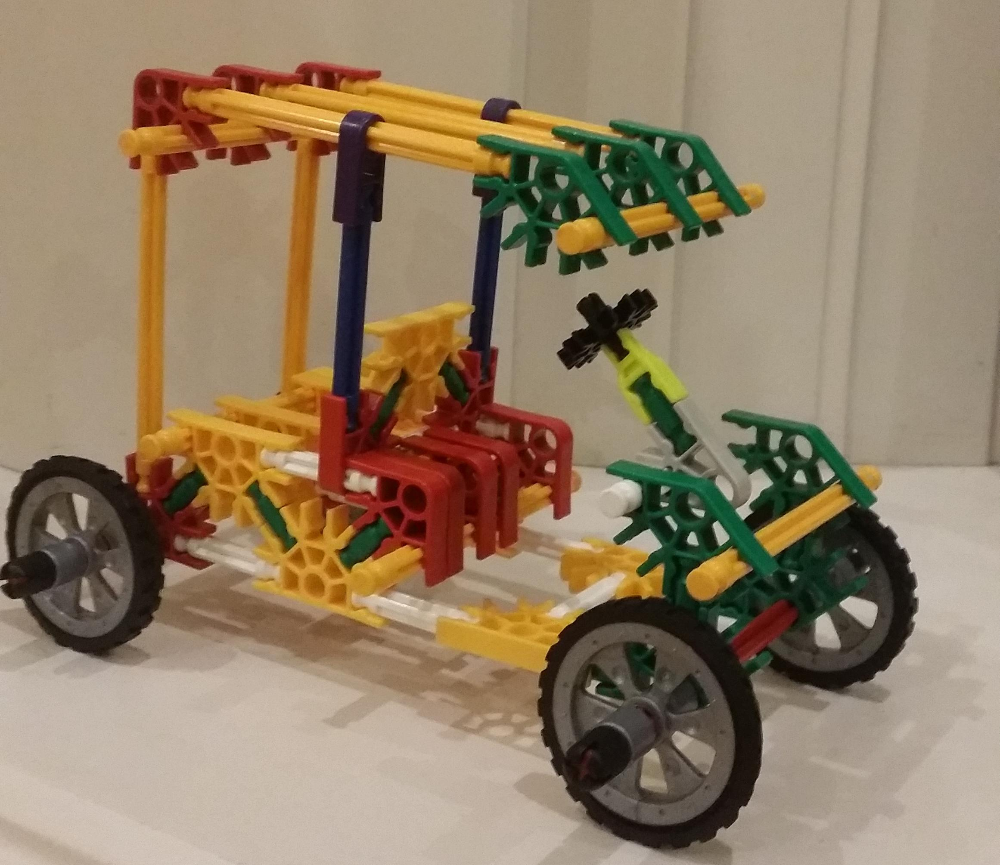

Using a rubber-band and K'nex to build a catapult to fire K'nex missiles.
We usually start building and see what comes out. Normally it's a vehicle, but today it's a catapult. 

## Knex Catapult

## Knex Car
Normally, we make vehicles including space-ships and cars - like this one:

