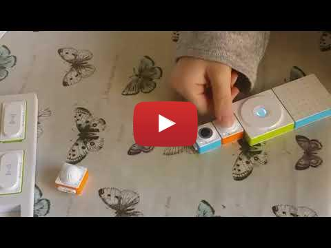
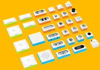
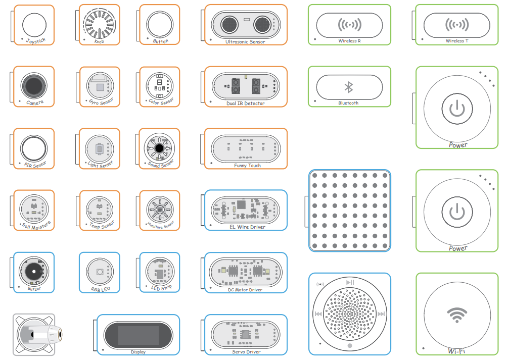
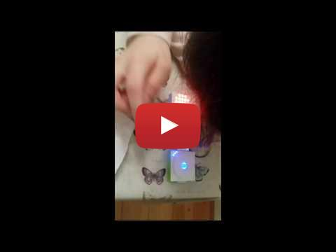

The Makeblock Neuron system offers over 30 electronic blocks, including a voice sensor, light sensor and infrared sensor. It makes it very easy for kids to create functional circuits easily e.g. an ultrasonic distance measurement tool, a voice-activated emoji. Components can be programmed also.

Overall, it's a very polished product: from the block design, user friendliness, packaging, support material and documentation.
And it's fun and educational to play with.

See https://www.makeblock.com/steam-kits/neuron

## Makeblock Neuron Blocks

#### Control interfaces:
- Buttons
- Knobs
- Joysticks 
- Capacitive touch
- Voice recognition

#### Input methods:
- Color sensor
- Ultrasonic distance
- Gyroscope
- Light intensity
- Sound intensity
- Temperature
- Humiture - Humidity and Temperature
- Soil moisture
- PIR (Passive Infra Red)
- Camera

#### Output methods:
- Dual DC motor drive
- Dual servo driver
- RGB LED
- LED matrix
- Electroluminescent wire
- Speaker
- Buzzer
- Display

#### Wireless communication:
- Bluetooth
- Wi-Fi
- Wireless transmitter and receiver

## MakeBlock Neuron Touch a wire to select an Emoji 

## Makeblock Voice Activated Emojis

## Spare parts
Individual parts can be ordered from various stores e.g. https://www.kiwi-electronics.nl in Europe.

Some parts are fragile e.g. 
- the knob where the knob can be twisted too much and the plastic pillar between the know and the resistor snaps. This is about 13 EUR.
- the LED which has wires soldered 

The Makeblock Neuron All-in-one-kit comes with 2 power supplies. 
An extra power block allows more simultaneous activities - and is handy in case power is low on another block.

## Under the hood
https://www.allaboutcircuits.com/news/makeblock-neuron-a-study-in-modular-design/ gives a good overview of the electronics and protocols used.
