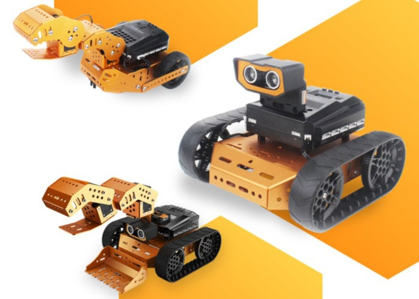
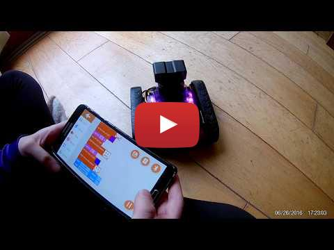
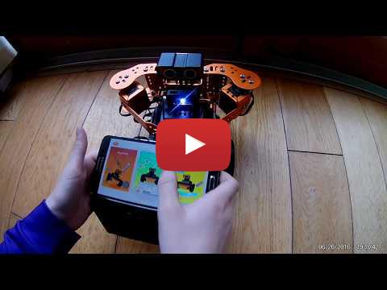

Qdee is a robot based on Micro:bit. It can be programmed via Micro:bit block language, or controlled via an app. Many different robot configurations are supported.

The documentation, online tutorials, and overall packaging are very good.

Qdee started via https://www.kickstarter.com/projects/44621210/qdee-robot-kit-a-whole-new-world-of-play-to-micro

A complete set of tutorial videos are available on https://www.youtube.com/playlist?list=PLFbzd0m6AcmJ7J34DQxxbEJc-h9BkFc8B&disable_polymer=true



## Coding
[](https://www.youtube.com/watch?v=S7Yrx2RexNQ)

The Coding interface via the app is intuitive for someone who has done block coding before e.g. Micro:bit or Scratch. Code is downloaded direct from the app easily to Qdee.

Code can also be written via https://makecode.microbit.org/ with a Qdee extension - but the code download is more manual.


## Control
[](https://www.youtube.com/watch?v=3wBtYJfprvA)

Qdee can be controlled via the app - control mode. 

(The servo motors are not yet in App v1.4.)


## Build

### Control
We can control Qdee from the app without writing any code using the Control windows.

To control Qdee from a phone or tablet we need to:

- Download the Qdee app (e.g. from Google Play store) to your phone or tablet 
- Download the control.hex file to Qdee (this is required to connect via Bluetooth)
- Connect from phone to Qdee via Bluetooth

### Downloading Code To Qdee
To download code to Qdee from a PC:
1. Connect USB cable from Qdee to PC
2. Copy the .hex file to Qdee e.g. 
```
QdeeStarter$ cp ./Chapter-2-program/control.hex /media/MICROBIT
```

see https://lancaster-university.github.io/microbit-docs/offline-toolchains/  for more info


