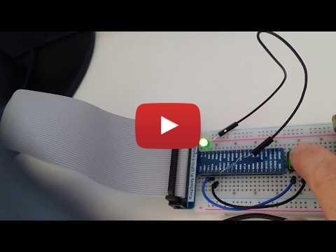
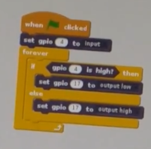

# Use a Raspberry Pi to turn LED on and off every second

## Demo Raspberry Pi With Electronics

## Materials Required

* Raspberry Pi and MicroSD card
* Electronics
  * LED
  * Switch
  * Breadboard
  * Wires
* RaspberryPi header breakout cable

## Scratch Code to read a switch and turn LED on

Raspberry Pi detects switch is pressed. 
If pressed, turns on LED.

## Questions

* How would we turn the LED off if switch is pressed?
* How would we turn the LED in on for 10 seconds if switch is pressed?
