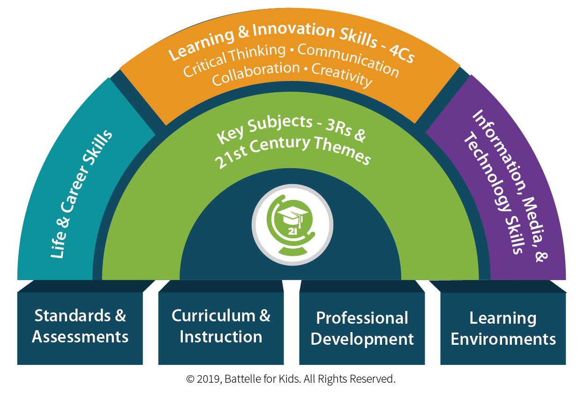

**This is a gathering of my thoughts and experiences as a STEM parent (working in a profession that relates to Science, Technology, Engineering, Maths) who led a series of STEM classes with my kids' school. It's a retrospective. It is written primarily for my benefit, but others may find it useful.**

**The main outcome of this stage was a [presentation ](https://docs.google.com/presentation/d/1vLz-oIf_13jl7KrR4l1jtORkT0xjbGgKtymp9oGGvdw/edit?usp=sharing ) to the school for a STEM curriculum driven by STEM parents.**

---
See the full series of blogs on the STEM workshop:                                         
1. [STEM Workshop With My Kids School - Part 1 - Before the STEM Workshop](../STEMParents1)
2. [STEM Workshop With My Kids School - Part 2 - The STEM Workshop](../STEMParents2)       
3. [STEM Workshop With My Kids School - Part 3 - Where To From Here](../STEMParents3)      
4. [STEM Workshop With My Kids School - Part 4 - STEM Workshop Tweets](../STEMParents4)      

---

# Before the STEM Workshop

## About Me
I work as a software security and system architect in the payments industry. My college education was in Electronic Engineering. I'm about half way through my working career age-wise, and near the top in terms of the technical ladder I chose. My wife works as an environmental consultant (though also has an Electronic Engineering college education just like me).

I have 2 kids who both go to the same primary school

- a daughter aged 11 who is very good at art, creativity, writing, Irish dancing, and academic subjects and academic environment in general. She attends 3 Irish dancing classes a week and a Feis competition every 2 months or so.
- a boy aged 8 who has a knack for engineering and maths and games like card games, draughts and chess. He attends 3 soccer classes a week. I volunteered as a coach this year to help out with the club.

Adding in the various extra activities like birthdays and playdates and other social activities means there's a lot going on.

I enjoy mountain biking - commuting to work by bike each day - and getting out in the mountains nearby on the weekend.

In my very limited spare time, I enjoy learning and playing with new technologies.

## Why I got involved
- To spend fun time with my kids on something we all enjoy
- My kids learn and enjoy STEM (doing it with their friends reinforces this)
- People working in STEM professions can provide contemporary relevant content to kids - this is part of what the Department of Education publications prescribe.
- Schools prepare kids for life after school
- I saw an opportunity based on what I had, and what I felt the school needed, to make a significant contribution

## How I got involved
The school used to publish the school holiday calendar in an Excel sheet on their website. At the start of each school year, I converted this to a Google Calendar so that I would be automatically reminded about these holidays, and shared it with my daughter's class parent's group. One of the parents on the Parent's Association approached me about assisting the school to do this, and helping out on the school website which, at the time, needed an overhaul. Through this approach, I met another parent who was on the school board, and happened to live nearby.

Before I got involved, one of the STEM parents did a class on statistics the previous year. This opened up the possibility in my mind and planted the seed.
I offered to assist on the school website, but suggested that the students do it, and I'd facilitate. I had been studying customer-centric product delivery for my work, and viewed the student as the customer of the school. As the website was the digital interface to parents, allowing the students to update it would bring the students and parents closer to the school. This led to a [presentation ](https://docs.google.com/presentation/d/1vLz-oIf_13jl7KrR4l1jtORkT0xjbGgKtymp9oGGvdw/edit?usp=sharing ) to the school IT Committee in September 2017.

Before the [presentation](https://docs.google.com/presentation/d/1vLz-oIf_13jl7KrR4l1jtORkT0xjbGgKtymp9oGGvdw/edit?usp=sharing), I felt my biggest gap was being able to communicate with the school; I work in a very different culture and environment, and had no experience working with primary school staff. I sought advice from one of the parents who had done after-school classes and was used to working with the school. While the presentation went well, the followup with the school didn't. We may as well have been from different planets - neither right or wrong - both just very different. I liaised with the school through the parent on the board. I joined various Facebook STEM Teacher groups to better understand the STEM teacher's perspective and needs.

## A Fortuitous Encounter
In summer 2018, I took my kids and their friends to the Amazon open day at ITT Tallaght. After the outdoor activities and ice cream, they attended a Micro-bit coding class hosted by Keith Quille (http://keithquille.com). I got talking to him, commending him on how well he delivered the class, and mentioned some of the STEM activities I did with my kids, and how I was trying to do these with their school. 

Keith is a very nice guy, and very knowledgeable in this area. Keith was commissioned to develop resources by the NCCA. He has a PhD in this area - and is active in teaching STEM classes to children of all ages. He offered to contribute the the STEM classes.

## The Vision
The vision as presented to the school was "A curriculum of STEM classes that builds towards a product (an end deliverable) over the course of the term. It's designed to “light up the rainbow” of 21st century skills using the latest industry tools. 

It is based on Active Learning where “Active learning is the principal learning and teaching approach recommended for SPHE” where SPHE is Social, Personal and Health Education as defined in the DoE primary curriculum

STEM Industry expert parents will coach on topics that they are industry experts in e.g. Product Innovation, Design Thinking, User eXperience, statistics, Project Management, Lean, Scrum, etc.."

This applied 2 important industry concepts:

- each class would address a step in the product development lifecycle in a lite version "The Lean Product Playbook: How to Innovate with Minimum Viable Products and Rapid Customer Feedback" 
- the class would be organised into Scrum teams as done in the IT industry. eduscrum, is an applied version for education where for the learning process is delegated from teachers to students.

**The vision as presented to the school is** [here ](https://docs.google.com/presentation/d/1vLz-oIf_13jl7KrR4l1jtORkT0xjbGgKtymp9oGGvdw/edit?usp=sharing )

## 21st Century Skills

### Communication, Collaboration, Creativity, and Critical Thinking
I had researched various pedagogies and compiled [a summary of pedagogies I liked]( https://drive.google.com/file/d/0BwrM9BmHsajKdWNzTEVrRmh2c1p6QXBRWkF4Sk43bkkzbUJr/view?usp=sharing)

Of these [ P21 (Program for 21st Century skills)](http://www.battelleforkids.org/networks/p21/frameworks-resources) was the best with emphasis on [ 4 the C's: Communication, Collaboration, Creativity, and Critical Thinking ](http://static.battelleforkids.org/documents/p21/P21_framework_0816_2pgs.pdf) and  Life and career skills, and  Information, Media, and Technology skills. 

### Grit and Determination
It's important for kids to see mistakes and failures as opportunities to learn. While a once off workshop does allow for some trial and error, it's difficult to reinforce grit and determination in such a short amount of time.

## STEM Classes With My Kids And Their Friends
Having developed an interest and vision, I ran some STEM activities with my kids and their friends on the weekends. This worked out well - with the kids asking me if I could do one each weekend and have their fiends over.

A Social Media Profile 
As I spent more time thinking about STEM in education and doing STEM activities with my kids, I decided to build a social media profile to manage the content. 

openstemkids was chosen because it was STEM for kids developed in an open source collaborative way.

I created a [website](https://www.openstemkids.com/), [Twitter](https://twitter.com/STEMOpen), and [Youtube channel](https://www.youtube.com/channel/UClT-YU-Yl_3to7yXAHEeuqA). 

## Workshop Offer
In November 2018, the STEM parents were contacted by the parent on the board to provide our availability for the STEM classes. I said I was available for Friday mornings and suggested we do this after Christmas as November/December is a busy time of year for parents.

I was about half way through studying for a work related course and certification but parked this when the offer came.

