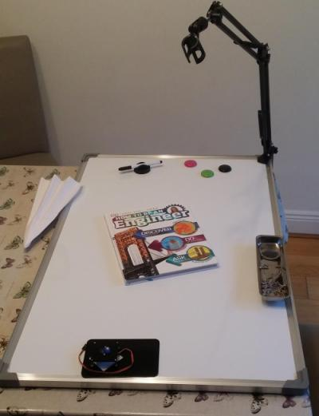

# Setup a worktop

* We want to 
  * write notes on the workspace
  * record our work - video and sound
  * protect the surface underneath
  * have good light

* Our worktop 
  * a whiteboard as the worktop (e.g. EUR 20 in Lidl)
  * attach a [microphone arm](https://www.amazon.co.uk/dp/B00GLJDMPO/ref=pe_3187911_189395841_TE_dp_1) (~EUR 10 from Amazon)
    * video camera to record video and sound
    * light
  * optional: use a tray for screws that magnetically attaches to the whiteboard

## Setup a workspace
Find and setup a room in which you can work.

