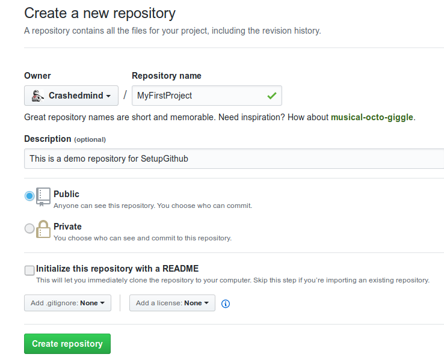
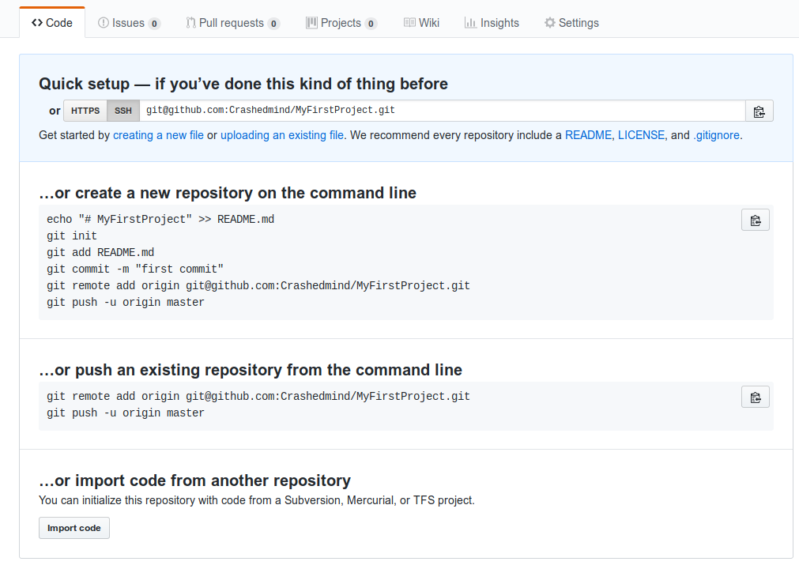
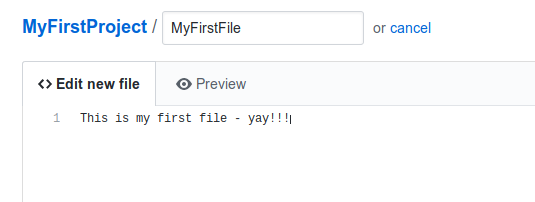

# Setup a Github account

We want to 
* save the project files that we create in one place including
  * source code
  * pictures
  * notes
* keep a history of our edits
* share our content

So we setup a free Github account.

To join Github, you need an email address to verify your account

# Instructions
1. Open browser at www.github.com
2. Click "Sign up"
3. Create personal account
4. Follow steps on https://www.wikihow.com/Create-an-Account-on-GitHub
5. See https://guides.github.com/activities/hello-world/ for a good overview tutorial

# Create A Repository
A Repository is a place to store our files. 
We will create a repository for our project called "MyFirstProject"

# Create A File

https://github.com/Crashedmind/MyFirstProject/blob/master/MyFirstFile
