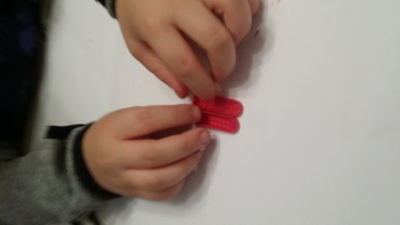
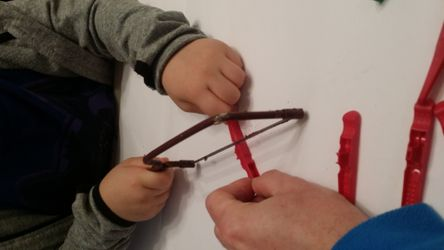
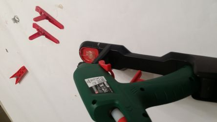
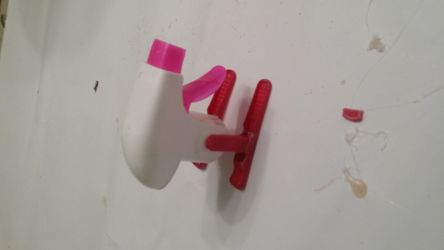
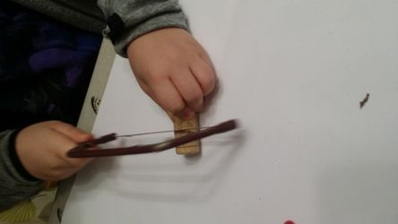
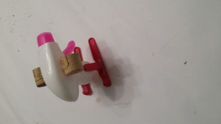
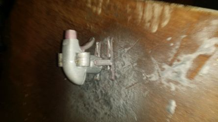
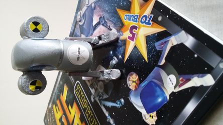
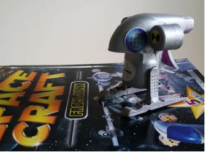

        

## Materials Required

1. Spray bottle
2. 2 x Plastic clothes pegs
3. Bottle cork
4. Paint

## Teaches
1. Arts and Crafts building a spaceship
2. Using a junior hacksaw, and a glue gun, and spray paint
   
## Build 

Instructions and stickers in book: Making Space Craft From Junk https://www.amazon.com/Making-Space-Craft-Stephen-Munzer/dp/095715660X